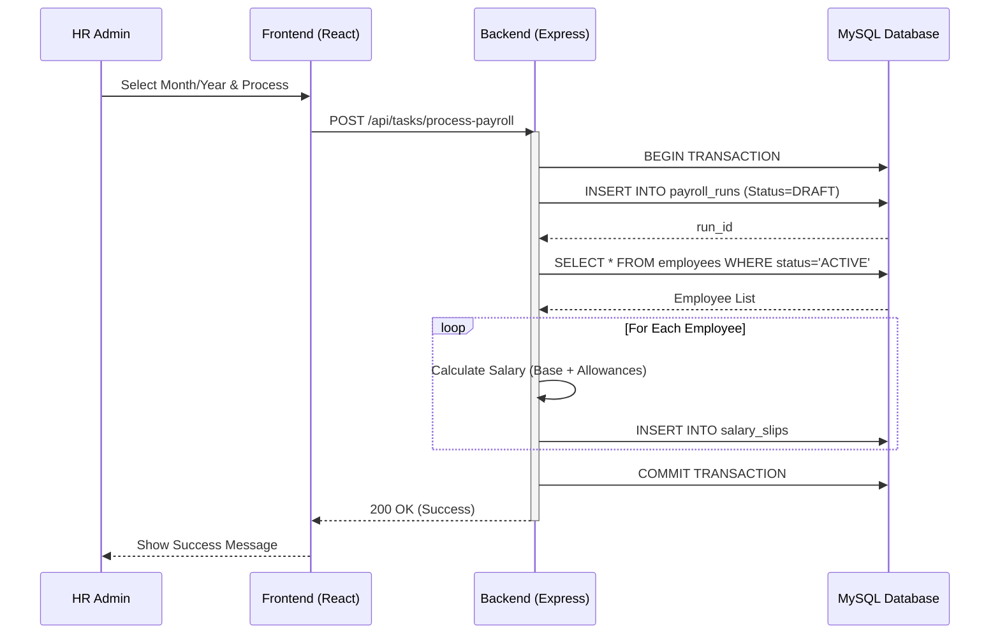
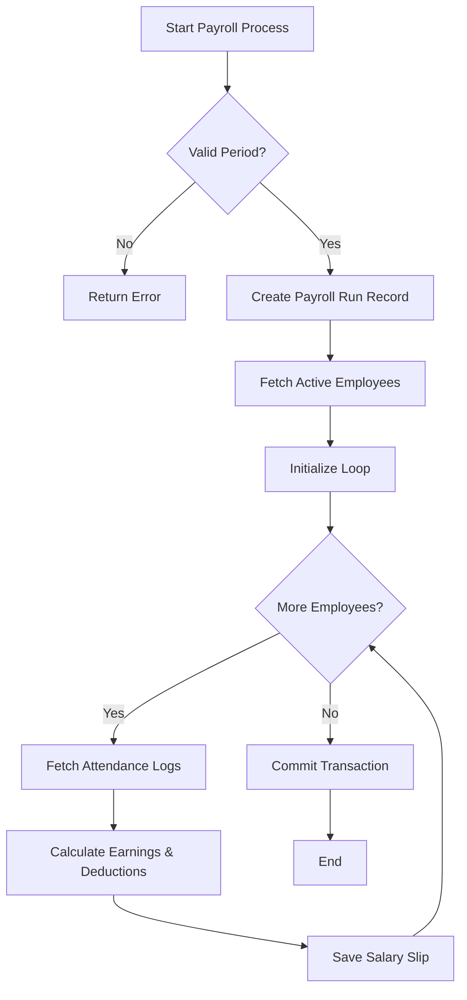
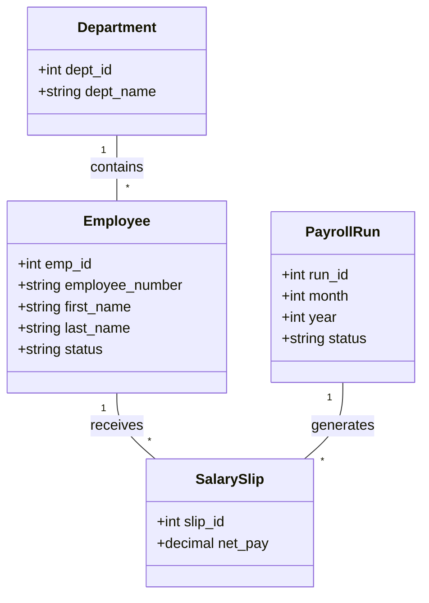

# OXVhr - HR & Payroll Management System

OXVhr is a specialized HR and Payroll management module designed for robust employee lifecycle management, attendance tracking, and automated payroll processing.

## 🏗️ System Architecture

The project follows a standard MERN-like stack:
- **Frontend**: React (TypeScript) with Vite
- **Backend**: Node.js (Express)
- **Database**: MySQL

---

## 📊 UML Documentation

This section provides a visual overview of the system's logic and structure. We use **Mermaid.js** for embedded diagrams.

### 1. Use Case Diagram
Describes the primary interactions between different users (Actors) and the system.

```mermaid
useCaseDiagram
    actor "HR Administrator" as Admin
    actor "Department Manager" as Manager
    actor "Employee" as Emp

    package "OXVhr Module" {
        package "Employee Management" {
            usecase "Register Staff" as UC1
            usecase "Update Details" as UC2
            usecase "Manage Status" as UC3
        }
        package "Financial Engine" {
            usecase "Configure Salary" as UC4
            usecase "Execute Payroll" as UC5
            usecase "Generate Reports" as UC6
        }
        package "Attendance & Leave" {
            usecase "Mark Attendance" as UC7
            usecase "Submit Leave" as UC8
            usecase "Approve/Reject Leave" as UC9
        }
        usecase "View Payslips" as UC10
    }

    Admin --> UC1
    Admin --> UC2
    Admin --> UC3
    Admin --> UC4
    Admin --> UC5
    Admin --> UC6
    
    Manager --> UC9
    Manager --> UC6

    Emp --> UC7
    Emp --> UC8
    Emp --> UC10

    UC5 ..> UC7 : <<include>>
```

### 2. Sequence Diagram: Monthly Payroll Processing
Illustrates the step-by-step interaction between components during a payroll run.



### 3. Activity Diagram: Payroll Business Logic
Shows the flow of control and decision points during the payroll calculation.



### 4. Entity Relationship / Class Diagram
Represents the core data structures and their relationships.



---

## 🛠️ Development Tools

- **PlantUML**: Original source for complex diagrams can be found in `DIAGRAMS.txt`.
- **Mermaid.js**: Used for GitHub README visualization.
- **MySQL Workbench**: Recommended for direct database modeling.

## 🚀 Getting Started

### Prerequisites
- Node.js (v18+)
- MySQL

### Setup
1. Clone the repository.
2. Install dependencies:
   ```bash
   npm install && cd frontend && npm install
   ```
3. Configure `.env` in the `backend/` directory.
4. Run the development servers:
   ```bash
   # Backend
   cd backend && npm start
   # Frontend
   cd frontend && npm run dev
   ```
